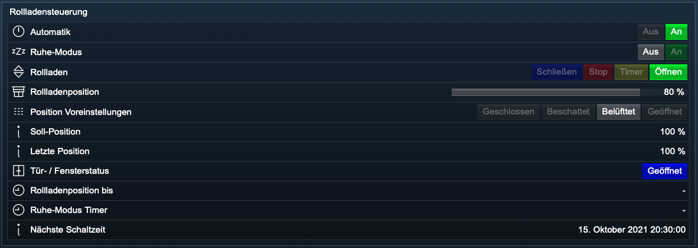

# Rollladensteuerung

Integriert [HomeMatic](https://www.eq-3.de/start.html) und [Homematic IP](https://www.eq-3.de/start.html) Rollladenaktoren in [IP-Symcon](https://www.symcon.de).

Unterstütze Aktoren:

        * HM-LC-Bl1-FM
        * HmIP-BROLL
        * HmIP-FROLL

Für dieses Modul besteht kein Anspruch auf Fehlerfreiheit, Weiterentwicklung, sonstige Unterstützung oder Support.
Bevor das Modul installiert wird, sollte unbedingt ein Backup von IP-Symcon durchgeführt werden.
Der Entwickler haftet nicht für eventuell auftretende Datenverluste oder sonstige Schäden.
Der Nutzer stimmt den o.a. Bedingungen, sowie den Lizenzbedingungen ausdrücklich zu.

Zur Verwendung dieses Moduls als Privatperson, Einrichter oder Integrator wenden Sie sich bitte zunächst an den Autor.

### Inhaltsverzeichnis

1. [Rollladensteuerung](#1-rollladensteuerung)
2. [Wochenplan](#2-wochenplan)
3. [PHP-Befehlsreferenz](#3-php-befehlsreferenz)

### 1. Rollladensteuerung

[]()

##### Wichtiger Hinweis:

Das Modul Rollladensteuerung besitzt folgende Logik:

0%      = runter / geschlossen  
100%    = hoch / geöffnet

Falls die Drehrichtung des Motors nicht mit der Logik des Schaltaktors übereinstimmt (Anschlußkabel vertauscht), kann in der Instanzkonfiguration das Verhalten (Logik) des Rollladenaktors ausgewählt werden.  
Das Modul Rollladensteuerung wird den Rollladenaktor dann immer entsprechend der Modul-Logik schalten.

### 2. Wochenplan

[]()

- Es dürfen nur zwei Aktionen ohne Aktionstyp angelegt werden:
    * ID 1 Rollladen runter
    * ID 2 Rollladen hoch

- Unter Wochenplan als Gruppe `Zwei Gruppen: Arbeitstage (MO -Fr) und Wochenende (Sa + So)` auswählen.
- Legen Sie die Zeiten zum hoch- und runterfahren fest.

### 3. PHP-Befehlsreferenz

Behanghöhe des Rollladens steuern:

```text
boolean UBRS_MoveBlind(integer $InstanceID, integer $Position, integer $Duration, integer $DurationUnit);  

$DurationUnit: 0 = Sekunden, 1 = Minuten  

Liefert als Rückgabewert: false | true

Beispiele:

Rollladen dauerhaft schließen (0 %):  
UBRS_MoveBlind(12345, 0, 0, 0);  

Rollladen für 180 Sekunden öffnen (100 %):  
UBRS_MoveBlind(12345, 100, 180, 0);  

Rollladen für 5 Minuten öffnen (100 %):  
UBRS_MoveBlind(12345, 100, 5, 1);  

Rollladen dauerhaft auf 70% öffnen:  
UBRS_MoveBlind(12345, 70, 0, 0);  
```  

Aktuelle Behanghöhe des Rollladens abfragen:

```text
RS_UpdateBlindLevel(integer $InstanzID);   
  
Fragt den aktuellen Status (Behanghöhe) ab und aktualisiert den Schieberegler Rollladen.  

RS_UpdateBlindLevel(12345);  
```