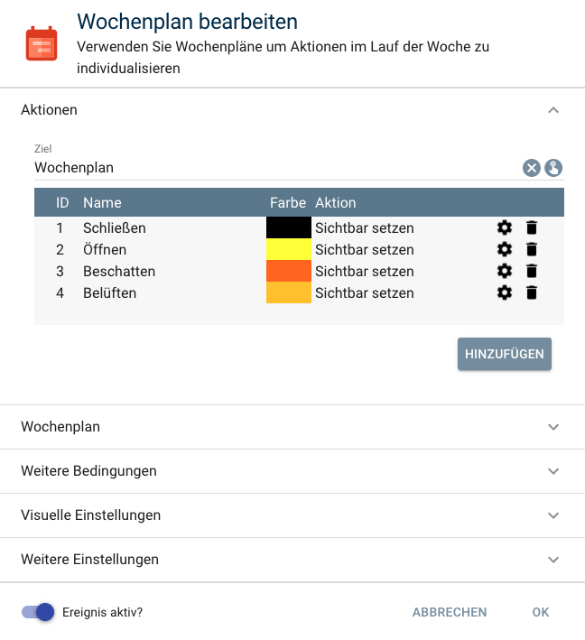

# Rollladensteuerung

[](https://www.homematic-ip.com/start.html)

Integriert [HomeMatic](https://www.homematic.com/licht-schatten.html) und [Homematic IP](https://www.homematic-ip.com/produkte/rolllaeden-jalousien-und-markisen.html) Rollladenaktoren in [IP-Symcon](https://www.symcon.de) und fährt auf Grundlage von definierten Zeiten innerhalb eines Wochenplans einen Rollladen automatisch hoch und runter.  

Ebenfalls ist eine manuelle Steuerung jederzeit möglich.  

Unterstütze Aktoren:  

* HM-LC-Bl1-FM
* HmIP-BROLL
* HmIP-FROLL  

Für dieses Modul besteht kein Anspruch auf Fehlerfreiheit, Weiterentwicklung, sonstige Unterstützung oder Support.

Bevor das Modul installiert wird, sollte unbedingt ein Backup von IP-Symcon durchgeführt werden.

Der Entwickler haftet nicht für eventuell auftretende Datenverluste oder sonstige Schäden.

Der Nutzer stimmt den o.a. Bedingungen, sowie den Lizenzbedingungen ausdrücklich zu.

##### Wichtiger Hinweis:

Das Modul Rollladensteuerung besitzt folgende Logik:

0%      = runter / geschlossen  
100%    = hoch / geöffnet 

Falls die Drehrichtung des Motors nicht mit der Logik des Schaltaktors übereinstimmt (Anschlußkabel vertauscht), kann in der Instanzkonfiguration das Verhalten (Logik) des Rollladenaktors ausgewählt werden.  
Das Modul Rollladensteuerung wird den Rollladenaktor dann immer entsprechend der Modul-Logik schalten.

### Inhaltverzeichnis

1. [Funktionsumfang](#1-funktionsumfang)
2. [Voraussetzungen](#2-voraussetzungen)
3. [Software-Installation](#3-software-installation)
4. [Einrichten der Instanzen in IP-Symcon](#4-einrichten-der-instanzen-in-ip-symcon)
5. [Statusvariablen und Profile](#5-statusvariablen-und-profile)
6. [WebFront](#6-webfront)
7. [PHP-Befehlsreferenz](#7-php-befehlsreferenz)

### 1. Funktionsumfang

* Automatikmodus
    * Hoch- / Runterfahren zu vorgegeben Zeiten innerhalb eines Wochenplans (Mo-Fr, Sa-So) 
    * Aktionsverzögerung
    * Aussperrschutz
    * Individuelle Rollladenposition (geschlossen/geöffnet)
* Manueller Modus
    *  Manuelles Hoch- / Runterfahren  

### 2. Voraussetzungen

- IP-Symcon ab Version 5.1
- Homematic IP Rollladenaktor:
    * HM-LC-Bl1-FM
    * HmIP-BROLL
    * HmIP-FROLL  

### 3. Software-Installation

- Bei kommerzieller Nutzung (z.B. als Einrichter oder Integrator) wenden Sie sich bitte zunächst an den Autor.
  
- Bei privater Nutzung wird das Modul über das [Module Control](https://www.symcon.de/service/dokumentation/modulreferenz/module-control/) installiert. Fügen Sie folgende URL hinzu:  

`https://github.com/ubittner/Rollladensteuerung`

### 4. Einrichten der Instanzen in IP-Symcon

- Zunächst wird ein [Wochenplan](https://www.symcon.de/service/dokumentation/konzepte/ereignisse/wochenplan/) benötigt.  

- In IP-Symcon an beliebiger Stelle `Ereignis hinzufügen` auswählen und `Wochenplan` auswählen.

[]()  

- Es dürfen nur zwei Aktionen ohne Aktionstyp angelegt werden:
    * ID 1 Rollladen runter
    * ID 2 Rollladen hoch  

- Unter Wochenplan als Gruppe `Zwei Gruppen: Arbeitstage (MO -Fr) und Wochenende (Sa + So)` auswählen.

- Legen Sie die Zeiten zum hoch- und runterfahren fest.

- Nun kann die Rollladensteuerung in IP-Symcon hinzugefügt werden. An beliebiger Stelle im Objektbaum `Instanz hinzufügen` auswählen und `Rollladensteuerung` auswählen, welches unter dem Hersteller `UBS3` aufgeführt ist. Es wird eine Instanz angelegt, in der die Eigenschaften zur Steuerung des Rollladens festgelegt werden können.

__Konfigurationsseite__:

Name                                | Beschreibung
----------------------------------- | ---------------------------------
(0) Instanzinformationen            | Instanzinformationen
(1) Automatik                       | Auswahl des zu verwendenen Wochenplans und weitere Einstellungen
(2) Rollladenaktor                  | Auswahl des Rollladenaktors und weitere Einstellungen 
(3) Sicherung / Wiederherstellung   | Speichern und Wiederherstellen der Konfiguration  

### 5. Statusvariablen und Profile  

Die Statusvariablen / Kategorien werden automatisch angelegt. Das Löschen einzelner kann zu Fehlfunktionen führen.

##### Statusvariablen

Name                    | Typ       | Beschreibung
----------------------- | --------- | ----------------
Automatik               | Boolean   | De- / Aktiviert den Automatikmodus 
Rollladen               | Float     | Steuert den Rollladen hoch und runter
Nächster Schaltvorgang  | String    | Zeigt den nächsten Schaltvorgang an

##### Profile:

Nachfolgende Profile werden zusätzlichen hinzugefügt:

RS.InstanzID.BlindSlider.Reversed

Wird die Instanz gelöscht, so werden automatisch die oben aufgeführten Profile gelöscht.

### 6. WebFront

Über das WebFront kann der Automatikmodus ein- und ausgeschaltet werden.  
Ist der Automatikmodus eingeschaltet wird bei einem zugewiesenen Wochenplan der Rollladen zu den definierten Zeiten automatisch hoch- und runtergefahren.   
Eine manuelle Steuerung des Rollladens ist über den Schieberegler zu jederzeit möglich.  
Der nächste Schaltvorgang wird im WenFront angezeigt, sofern der Automatikmodus eingeschaltet ist.

### 7. PHP-Befehlsreferenz  

Behanghöhe des Rollladens steuern:

```text
float RS_SetBlindLevel(integer $InstanzID, float $Level);  
  
Setzt den Rollladen auf die entsprechende Behanghöhe.  
$Level = 0 ist immer    0% = Geschlossen  
$Level = 1 ist immer  100% = Geöffnet  
  
Beispiele:  
Rollladen geschlossen: RS_SetBlindLevel(12345, 0);  
Rollladen geöffnet: RS_SetBlindLevel(12345, 1);  
Rollladen zu 25% geöffnet: RS_SetBlindLevel(12345, 0.25);  
Rollladen zu 75% geöffnet: RS_SetBlindLevel(12345, 0.75);  
```  

Aktuelle Behanghöhe des Rollladens abfragen:

```text
RS_UpdateBlindLevel(integer $InstanzID);   
  
Fragt den aktuellen Status (Behanghöhe) ab und aktualisiert den Schieberegler Rollladen.  

RS_UpdateBlindLevel(12345);  
```